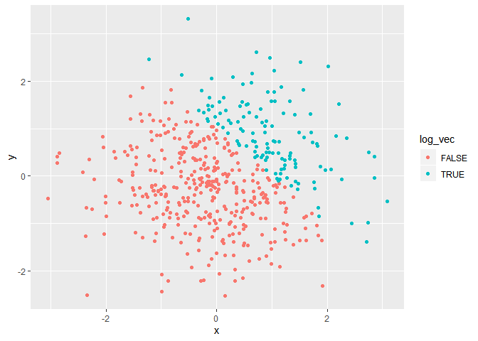
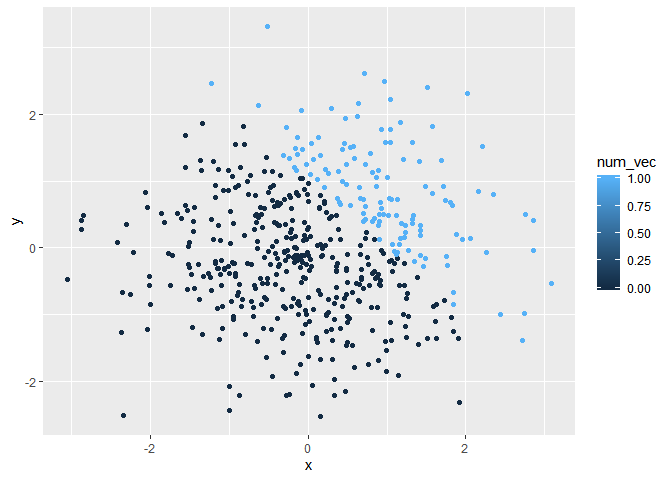
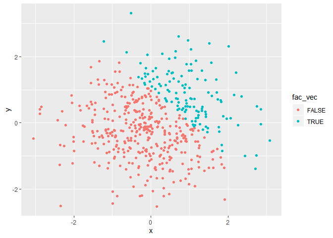

p8105\_hw1\_mfc2162
================

``` r
library(tidyverse)
```

    ## -- Attaching packages ------------------------------------------- tidyverse 1.2.1 --

    ## v ggplot2 3.2.0     v purrr   0.3.2
    ## v tibble  2.1.3     v dplyr   0.8.3
    ## v tidyr   0.8.3     v stringr 1.4.0
    ## v readr   1.3.1     v forcats 0.4.0

    ## -- Conflicts ---------------------------------------------- tidyverse_conflicts() --
    ## x dplyr::filter() masks stats::filter()
    ## x dplyr::lag()    masks stats::lag()

## Problem 1

#### Create dataframe

``` r
df1 = tibble(
  norm_samp = rnorm(8),
  vec_logical = norm_samp > 0,
  vec_char = c("There's", "always", "money", "in", "the", "banana", "stand",
               "!"),
  vec_factor = factor(c("medium", "low", "high", "medium", "low", "low",
                        "medium", "medium"))
)

df1
```

    ## # A tibble: 8 x 4
    ##   norm_samp vec_logical vec_char vec_factor
    ##       <dbl> <lgl>       <chr>    <fct>     
    ## 1    0.155  TRUE        There's  medium    
    ## 2   -1.09   FALSE       always   low       
    ## 3   -0.0235 FALSE       money    high      
    ## 4   -1.04   FALSE       in       medium    
    ## 5    0.457  TRUE        the      low       
    ## 6   -0.819  FALSE       banana   low       
    ## 7   -0.430  FALSE       stand    medium    
    ## 8    1.08   TRUE        !        medium

#### Take the mean of each variable

``` r
mean_samp = mean(pull(df1, norm_samp))
mean_logical = mean(pull(df1, vec_logical))
mean_char = mean(pull(df1, vec_char))
```

    ## Warning in mean.default(pull(df1, vec_char)): argument is not numeric or
    ## logical: returning NA

``` r
mean_factor = mean(pull(df1, vec_factor))
```

    ## Warning in mean.default(pull(df1, vec_factor)): argument is not numeric or
    ## logical: returning NA

``` r
mean_samp
```

    ## [1] -0.2153722

``` r
mean_logical
```

    ## [1] 0.375

``` r
mean_char
```

    ## [1] NA

``` r
mean_factor
```

    ## [1] NA

Taking the mean of the random sample variable and the logical variable
worked. Taking the mean of the character variable and the factor
variable did not work.

#### Apply as.numeric to variables

``` r
logical_num = as.numeric(pull(df1, vec_logical))
char_num = as.numeric(pull(df1, vec_char))
```

    ## Warning: NAs introduced by coercion

``` r
factor_num = as.numeric(pull(df1, vec_factor))
```

It works for the logical and factor variables, but not for the character
variable. Applying as.numeric to the logical variable just changes the
TRUE’s to 1’s and the FALSE’s to 0’s. Applying as.numeric to the factor
variable assigns a number to each level. In this case, it assigned 3 to
“medium”, 2 to “low”, and 1 to “high”. Applying as.numeric to a
character vector only works if the characters are numbers, such as
c(“3”, “6”, “8”, “3”, “7”). In this case, the characters were not
numbers, so it didn’t work.

#### Conversion and multiplication

``` r
logical_num = as.numeric(pull(df1, vec_logical))
product_num = logical_num * pull(df1, norm_samp)
product_num
```

    ## [1] 0.1549179 0.0000000 0.0000000 0.0000000 0.4568181 0.0000000 0.0000000
    ## [8] 1.0761794

``` r
logical_fac = as.factor(pull(df1, vec_logical))
product_fac = logical_fac * pull(df1, norm_samp)
```

    ## Warning in Ops.factor(logical_fac, pull(df1, norm_samp)): '*' not
    ## meaningful for factors

``` r
product_fac
```

    ## [1] NA NA NA NA NA NA NA NA

``` r
logical_fac_to_num = as.numeric(logical_fac)
product_fac_to_num = logical_fac_to_num * pull(df1, norm_samp)
product_fac_to_num
```

    ## [1]  0.3098358 -1.0946695 -0.0234560 -1.0437035  0.9136362 -0.8188154
    ## [7] -0.4302486  2.1523588

## Problem 2

#### Create data frame

``` r
df2 = tibble(
  x = rnorm(500),
  y = rnorm(500),
  log_vec = x + y > 1,
  num_vec = as.numeric(log_vec),
  fac_vec = as.factor(log_vec)
)

df2
```

    ## # A tibble: 500 x 5
    ##         x      y log_vec num_vec fac_vec
    ##     <dbl>  <dbl> <lgl>     <dbl> <fct>  
    ##  1 -1.39  -0.146 FALSE         0 FALSE  
    ##  2 -0.746 -1.33  FALSE         0 FALSE  
    ##  3 -2.57   0.940 FALSE         0 FALSE  
    ##  4 -0.218 -0.735 FALSE         0 FALSE  
    ##  5 -0.742 -1.11  FALSE         0 FALSE  
    ##  6 -1.11   1.67  FALSE         0 FALSE  
    ##  7 -1.16   0.165 FALSE         0 FALSE  
    ##  8  1.01   0.421 TRUE          1 TRUE   
    ##  9 -0.942 -0.774 FALSE         0 FALSE  
    ## 10  0.308  0.882 TRUE          1 TRUE   
    ## # ... with 490 more rows

#### Data description

The number of rows in the dataset is 500 and the number of columns is 5.

The mean of x is 0.0236415. The median of x is 0.0269707. The standard
deviation of x is 0.9919463.

The proportion of cases for which x + y \> 1 is 0.264.

#### Scatterplots

Color by logical variable

``` r
scatter1 = ggplot(df2, aes(x = x, y = y, color=log_vec)) + geom_point()
scatter1
```

<!-- -->

Color by numeric variable

``` r
ggplot(df2, aes(x = x, y = y, color=num_vec)) + geom_point()
```

<!-- -->

The color scale is continuous because numeric variables are continuous.
However, all of the points are either light blue or dark blue because
they are all 1 or 0.

Color by factor variable

``` r
ggplot(df2, aes(x = x, y = y, color=fac_vec)) + geom_point()
```

<!-- -->

The color scale is discrete because factor variables are made up of
discrete levels. Points are red if FALSE and blue if TRUE.

#### Export first scatterplot

``` r
ggsave("HW1_scatterplot.pdf", plot = scatter1, height = 4, width = 6)
```
